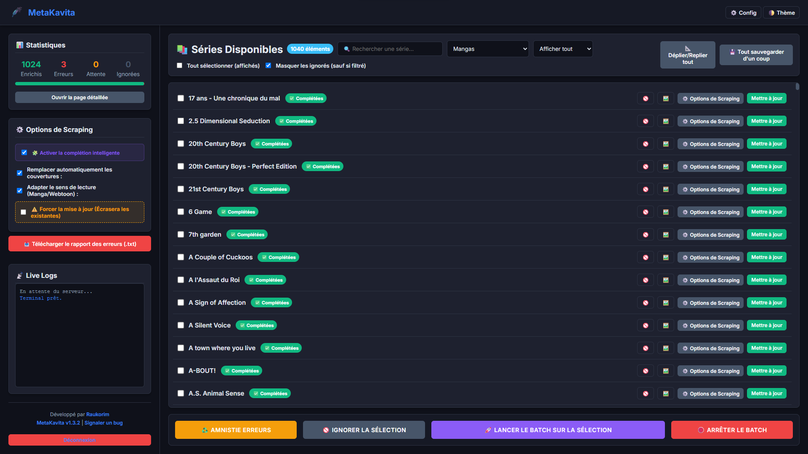
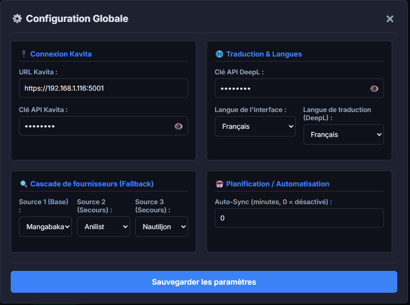
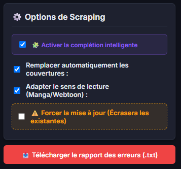
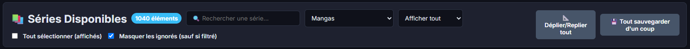
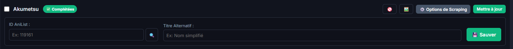
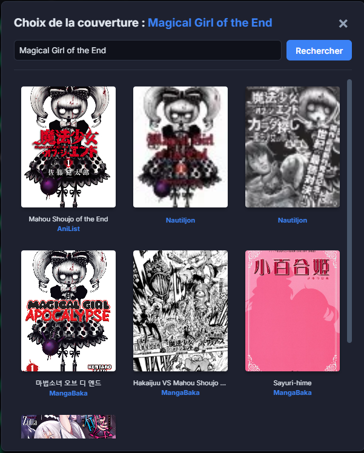
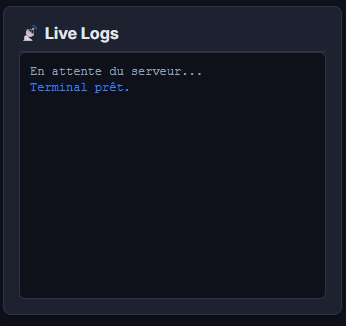
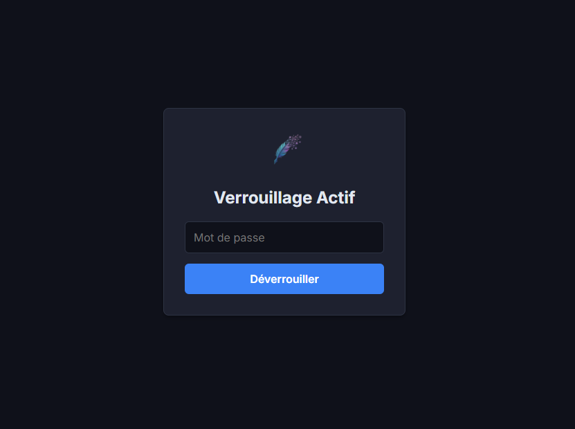

# MetaKavita

MetaKavita is an automated metadata enricher and manager for [Kavita](https://kavitareader.com/). It automatically detects library types (Manga, Comic, Book), scrapes summaries, release years, publication status, genres, tags, staff members, publishers, age ratings, and reading directions from public sources, translates summaries with Azure Translator or DeepL, and pushes them directly into your Kavita instance.

---

## Sommaire / Table of Contents
1. [🇺🇸 English Documentation](#-english-documentation)
   * [User Interface & Ergonomics](#-user-interface--ergonomics)
   * [Enriched Metadata Fields](#-enriched-metadata-fields)
   * [Quality, Reliability & Benchmarking](#-quality-reliability--engine-benchmarking)
   * [Installation (Zero-Effort & Source)](#-installation)
   * [Configuration Variables](#-configuration-variables)
   * [Translation APIs & Quotas](#-translation-apis--quotas)
   * [Reverse Proxy & Subpath Hosting](#-reverse-proxy--subpath-hosting)
   * [Auto-Sync & Webhooks](#-auto-sync--webhooks)
   * [Security Disclaimer & Best Practices](#-security-disclaimer--deployment-best-practices)
2. [🇫🇷 Documentation Française](#-documentation-française)
   * [Interface Utilisateur & Ergonomie](#-interface-utilisateur--ergonomie)
   * [Métadonnées Enrichies](#-métadonnées-enrichies)
   * [Assurance Qualité & Benchmarks Moteur](#-assurance-qualité--benchmarks-moteur)
   * [Installation (Zéro-Effort & Sources)](#-installation-1)
   * [Variables de Configuration](#-variables-de-configuration)
   * [APIs de Traduction & Quotas](#-apis-de-traduction--quotas)
   * [Reverse Proxy & Hébergement en Sous-dossier](#-reverse-proxy--hébergement-en-sous-dossier)
   * [Auto-Sync & Webhooks](#-auto-sync--webhooks-1)
   * [Avertissement de Sécurité & Bonnes Pratiques](#-avertissement-de-sécurité--bonnes-pratiques)
3. [⚠️ Notes & Tech Stack](#-notes--tech-stack)

---

## 🇺🇸 English Documentation

### 🎨 User Interface & Ergonomics (V1.5.5)

MetaKavita has been completely redesigned and heavily refined to separate background configuration from daily operational strategy, offering a zero-reload AJAX experience.

#### 1. Main Dashboard & Workspace Persistence
The interface uses a 100% AJAX layout with zero page reloads. The left sidebar handles active strategic options, while the main panel presents your library. Thanks to local storage persistence, the dashboard automatically remembers your selected library, status filter, hide ignored state, and search query between sessions.



#### 2. Clean, Dual-Form Architecture (Modal + Sidebar)
Technical infrastructure fields are isolated inside the **Global Configuration Modal** (accessible via the ⚙️ Config button in the topbar), preserving your workspace from configuration clutter. API Keys for metadata providers are neatly grouped in a dedicated section directly under the Kavita connection settings.
The left sidebar contains only the **Scraping Options** card for quick tactical switches (Smart Completion, Auto-Covers, Auto-Reading Direction, Force Update, Context Reset) and the download button for your error reports.




#### 3. Unified Filtering & Central Toolbar
The Library Selector, Search bar, and Status Filter are consolidated into a single horizontal toolbar. This puts all target controls on one cohesive line.
To the right, the **Expand/Collapse All** (`📐`) button allows you to toggle open all individual overrides panels for fast mass editing, next to the **Save All Overrides** button.



#### 4. The "Magic Input", Deep Extraction & Granular Scraping
Each series has an advanced Options panel and relies on a powerful underlying scraping engine:
*   **Deep Kavita Extraction & Smart Scoring**: Before querying the web, MetaKavita silently reads your existing Kavita metadata (like an embedded ISBN or an existing author). It uses this context in its unified scoring matrix (which favors Volume 1 for novels) to guarantee exact matches, anchor searches, and eliminate false positives.
*   **The "Magic Input" (Smart URL/ID Routing & Provider Forcing)**: Paste a direct URL (e.g., `https://kitsu.io/manga/attack-on-titan` or a Manga-News link), a slug, or a raw ID into this field. MetaKavita will auto-detect the provider, bypass the standard search cascade, and scrape that exact page! **Alternatively, selecting any provider from the dropdown while leaving the ID input box empty forces that specific scraper to perform a title search using your "Alternative Title" (or series name), bypassing library type restrictions.**
*   **Granular Scraping (Targeted Fields)**: Click the "⚙️ Targeted Fields" details menu to individually uncheck specific metadata fields (Summary, Cover, Authors, Tags, Publisher, etc.) you don't want MetaKavita to overwrite.
*   **Context Reset on Force Update**: When forcing an update on a mismatched series, a new sidebar toggle allows you to wipe the existing Kavita context to break negative feedback loops and start fresh.



#### 5. Live WebSocket Cover Streaming (*Progressive Loading*)
Manual cover searches stream image results live over WebSockets (`Socket.IO`) as each provider responds, rather than blocking until all scrapers finish. Each cover card smoothly fades into the grid in real-time, accompanied by a status bar.



#### 6. Live Processing Tracker & WS Logs
During batch execution, the active series being processed pulses with a glowing purple outline (`.is-processing`) and automatically scrolls into view. Badge statuses update dynamically on completion. The console displays real-time, sanitized, human-readable logs streamed via WebSockets.



#### 7. Global Authentication
The entire application can be locked behind a secure login screen with Timing-Attack immunity and brute-force delays.



---

### 📚 Enriched Metadata Fields

MetaKavita adapts its scraping strategy depending on Kavita's library types (`Manga`, `Comic`, `Book`) and maps the following metadata fields directly into Kavita's database structure:

| Category | Metadata Fields | Mapped Source Details |
| :--- | :--- | :--- |
| **Core Details** | Localized Name / Alternative Titles | Joins localized titles with a `" / "` separator |
| | Summary / Description | Scraped in source language, preserved as-is or translated via Azure, DeepL, or Google |
| | Release Year | Publication start year |
| | Publication Status | Maps to native codes: Ongoing, On Hiatus, Completed, Cancelled |
| | Language | Localized language translated target (e.g., `fr`, `en`) |
| **Collections & Lore** | Genres | Comprehensive mapping from visited sources |
| | Tags | Top 15 thematic categories |
| | Characters | Rich character lists populated in Kavita |
| **Staff & Editing** | Writers | Original Story authors & Scriptwriters |
| | Pencillers | Illustrators & Artists |
| | Colorists | Coloring staff |
| | Translators | Translation credits / Localization groups |
| | Cover Artists | Original cover artists |
| | Editors, Letterers, Inkers | Extended staff roles mapping |
| | Publisher | Official licensing publisher (*Pika*, *Glénat*, *Kodansha*, *Kurokawa*...) |
| **Classifications** | Reading Direction (Format) | Automatically set to Left-to-Right, Right-to-Left, or Vertical |
| | Age Rating | Maps to native ratings: Safe, Suggestive, Erotica, Pornographic |
| **External IDs** | External Platform IDs | Saves `AniListId`, `MalId`, and `MangaBakaId` |
| | Web Links | Builds active clickable direct URLs to official series pages |

---

### 🧪 Quality, Reliability & Engine Benchmarking

MetaKavita v1.5.5 undergoes rigorous automated stress testing across all metadata providers (Manga, Comic, Book) and core engine algorithms to ensure zero-crash operations, high-precision matching, and optimal performance:

*   **100% Core Scoring Matrix Accuracy**: Evaluated across 20 complex edge cases including Roman volume numerals (`Tome II` -> `Tome 2`), sub-volume subtitle matching, spin-off penalties (`-35%`), guidebook noise filtering (`-50%`), and author mismatch anti-homonym protections (`-50%`).
*   **56-Query Multi-Provider Stress Test**: Audited across all 12 active scrapers with **0 Python crashes**. Achieved 100% Webtoon reading direction detection, non-destructive regex handling for numeric titles (*20th Century Boys*), and French licensing publisher extraction (*Kurokawa*, *Panini*, *Ki-oon*, *Kbooks*, *Dargaud*).
*   **ComicVine Structured Search & Issue #1 Fallback**: Refactored ComicVine scraper utilizing structured `/volumes/?filter=name:` search with primary publisher prioritization (*DC Comics*, *Marvel*, *Image*, *Dargaud*) and Issue #1 plot synopsis/staff fallback (boosting empty volume stubs from 39 characters to 3,500+ character summaries).
*   **High-Speed Per-Provider Rate Limiter**: Replaced arbitrary fixed sleep delays with dynamic timestamp tracking (`LAST_REQUEST_TIMES`). Idle APIs respond instantly with zero artificial delay, executing 3-provider Smart Fusions in ~1.6 seconds without triggering HTTP 429 rate limits.

---

### 🚀 Installation

> ⚠️ **Security Note**: MetaKavita is designed primarily as an internal management tool (LAN / VPN). Before exposing it publicly to the web, please read the [Security Disclaimer & Best Practices](#-security-disclaimer--deployment-best-practices).

#### Option A: Pull pre-built image (Zero-Effort - Recommended)
No cloning required. Create a `docker-compose.yml` file anywhere on your server with the following content:

```yaml
services:
  metakavita:
    image: ghcr.io/raukorim-bot/metakavita:latest
    container_name: metakavita
    restart: unless-stopped
    ports:
      - "5010:5010"
    environment:
      - ADMIN_PASSWORD=your_secure_password
      # - ROOT_PATH=/metakavita # Optional subpath for reverse proxies
    volumes:
      - ./data:/app/data
```
Run `docker compose up -d` to launch the dashboard instantly on `http://localhost:5010`.

#### Option B: Build from Source
If you want to modify the code or run a custom build:
```bash
git clone https://github.com/raukorim-bot/MetaKavita.git
cd MetaKavita
docker compose up -d --build
```

---

### ⚙️ Configuration Variables

*MetaKavita features a Zero-Hardcode API Key engine. Any scraper declaring `needs_api_key = True` will automatically listen to its corresponding environment variable and dynamically render its input field in the UI.*

| Variable | Description | Default Value |
| :--- | :--- | :--- |
| `ADMIN_PASSWORD` | Secures the dashboard with a password. | *(Empty = No Auth)* |
| `ROOT_PATH` | Custom URL subpath when hosted behind a reverse proxy (e.g. `/metakavita`). | *(Empty)* |
| `KAVITA_URL` | Your Kavita instance URL. | *(Empty)* |
| `KAVITA_API_KEY` | Your Kavita API Key. | *(Empty)* |
| `TRANSLATION_PROVIDER` | Active translation engine (`GOOGLE`, `DEEPL`, `AZURE`, or `NONE` to disable). | `GOOGLE` |
| `AZURE_API_KEY` | Microsoft Azure Translator API Key (Primary Translation Engine). | *(Empty)* |
| `AZURE_REGION` | Microsoft Azure Translator API Region (e.g. `francecentral`). | *(Empty)* |
| `DEEPL_API_KEY` | Your DeepL Translation API Key (Fallback Translation Engine). | *(Empty)* |
| `COMICVINE_API_KEY`| Your ComicVine API Key (Required for Comics/BDs). | *(Empty)* |
| `GOOGLEBOOKS_API_KEY`| Google Books API Key (Optional, prevents HTTP 429 limit). | *(Empty)* |
| `HARDCOVER_API_KEY`| Hardcover API Key (Optional, required for Hardcover GraphQL search). | *(Empty)* |
| `TARGET_LANG` | Output language for summaries (`FR`, `EN`, `ES`...). Also dynamically changes Google Books search language! | `FR` |
| `UI_LANG` | Dashboard interface language (`fr` or `en`). | `fr` |
| `PROVIDER_1` | Primary manga metadata source (`MANGABAKA`, `KITSU`, `ANILIST`, `MANGADEX`, `MANGAUPDATES`, `MANGANEWS`, `SHIKIMORI`). | `MANGABAKA` |
| `PROVIDER_2` | Fallback manga source 1. | `KITSU` |
| `PROVIDER_3` | Fallback manga source 2. | `ANILIST` |
| `COMIC_PROVIDER_1`| Primary comic metadata source (`BEDETHEQUE`, `COMICVINE`, `GOOGLEBOOKS`, `OPENLIBRARY`, `HARDCOVER`, `ANILIST`). | `COMICVINE` |
| `COMIC_PROVIDER_2`| Fallback comic source 1. | `ANILIST` |
| `COMIC_PROVIDER_3`| Fallback comic source 2. | `NONE` |
| `BOOK_PROVIDER_1` | Primary book metadata source (`GOOGLEBOOKS`, `OPENLIBRARY`, `HARDCOVER`, `ANILIST`). | `GOOGLEBOOKS` |
| `BOOK_PROVIDER_2` | Fallback book source 1. | `OPENLIBRARY` |
| `BOOK_PROVIDER_3` | Fallback book source 2. | `NONE` |
| `SMART_COMPLETION`| Enable Data Fusion / Smart Patching (`true` or `false`). | `false` |
| `AUTO_SYNC_INTERVAL`| Background polling interval in minutes (`0` to disable). | `0` |
| `AUTO_COVER` | Automatically upload new covers to Kavita (`true` or `false`). | `false` |
| `AUTO_READING_DIR` | Auto-detect and set Manga/Webtoon reading direction. | `false` |

---

### 🌍 Translation APIs & Quotas

If you want to keep scraped descriptions in their original language without modification, select **Disabled (Keep original)** (`NONE`) as your Translation Provider.

If translation is enabled, keep in mind that the **DeepL Free API** is strictly limited to a **lifetime total of 1,000,000 characters**. MetaKavita integrates **Google Translate** out of the box for a free, zero-config experience. For maximum stability, we recommend setting up **Microsoft Azure Translator** (Free Tier F0 with **2,000,000 characters per month**) as your primary engine, with DeepL or Google as fallbacks.

---

### 🌐 Reverse Proxy & Subpath Hosting

MetaKavita supports subpath hosting (e.g., `https://your-domain.com/metakavita`) natively.

1. Set `ROOT_PATH=/metakavita` in your container environment variables.
2. In your reverse proxy (e.g., Nginx Proxy Manager or Traefik), route requests for `/metakavita` to the container port (`5010`).
3. Ensure WebSockets upgrade headers are passed (`Upgrade $http_upgrade` and `Connection "upgrade"`).

Client AJAX routes and Socket.IO connection paths will automatically adapt to the configured subpath while enforcing Same-Origin security.

> 💡 **Dual-Access Compatibility**: Enabling `ROOT_PATH` does not break direct access. MetaKavita remains accessible both through your reverse proxy subpath (`https://your-domain.com/metakavita`) and via direct local IP (`http://192.168.x.x:5010/`).

---

### 🤖 Auto-Sync & Webhooks

#### 1. Background Polling (Auto-Sync - Recommended)
Since Kavita does not natively provide outgoing Webhooks for library updates, MetaKavita uses background polling. Setting `AUTO_SYNC_INTERVAL` to a value higher than `0` (e.g., `30` minutes) schedules an automated task that periodically queries Kavita to fetch and process new or pending series.

#### 2. Webhook Endpoint for Custom Scripts & External Pipelines
For advanced workflows (e.g., n8n, Node-RED, or custom download post-processing scripts), MetaKavita exposes a dedicated endpoint to trigger instant processing for a specific series:
`POST http://<your-metakavita-ip>:5010/webhook?token=<YOUR_WEBHOOK_TOKEN>`

You can view your ready-to-use Webhook URL or generate a new token anytime directly inside the **Config Modal** (under the Planning section).

**Payload Example:**
```json
{
  "seriesId": 6827,
  "name": "Chiisakobe",
  "force": true
}
```
*(Setting `"force": true` in the JSON or adding `&force=true` to the URL triggers a forced re-scrape, overwriting existing metadata even if already marked as completed).*

---

### 🛡️ Security Disclaimer & Deployment Best Practices

#### 🏠 Primary Intended Use: Internal Backoffice
MetaKavita is designed primarily as an **internal management tool (backoffice)** intended to run within a local network (LAN) or a private network environment (such as WireGuard or Tailscale).

#### 🔒 Security Measures Included
Although designed for internal management, several security hardening controls are built into the application to mitigate common risks:
* **Authentication**: Password locking with timing-attack prevention (`secrets.compare_digest`) and artificial anti-brute-force delays.
* **Session Security**: Hardened `HttpOnly` and `SameSite=Lax` session cookies.
* **Proxy Restrictions**: Strict domain whitelisting on the `/api/proxy-image` endpoint to prevent SSRF (Server-Side Request Forgery) exploits.
* **Token Protection**: Webhooks require a cryptographically generated authorization token (`WEBHOOK_TOKEN`) with on-demand UI token rotation.
* **Credential Masking**: API keys are censored in the HTML DOM to protect sensitive values.

#### ⚠️ Important Notice for Public Web Exposure
The presence of built-in security features **does not guarantee absolute immunity against external threats**. Exposing MetaKavita directly to the open internet is done at your own risk.

**Recommended Security Layers for Public Exposure:**
1. **Reverse Proxy & HTTPS**: Always host MetaKavita behind a Reverse Proxy (Nginx, Traefik, Caddy) enforcing valid HTTPS/TLS encryption.
2. **Secondary Authentication Layer**: Combine the built-in login with an external authentication gateway (e.g., Authelia, Authentik, Cloudflare Access, or HTTP Basic Auth).
3. **Network Restrictions / VPN**: Restrict access to trusted IP ranges or keep access restricted to a private VPN whenever possible.
4. **Strong Passwords**: Define a long, complex `ADMIN_PASSWORD` in your container environment variables.

> **Disclaimer**: MetaKavita is provided "as-is" without warranty of any kind. The maintainers assume no liability for data loss, unauthorized access, or security incidents resulting from public exposure or network misconfiguration.

---

## 🇫🇷 Documentation Française

### 🎨 Interface Utilisateur & Ergonomie (V1.5.5)

MetaKavita a été entièrement repensé et peaufiné pour séparer la configuration technique de la stratégie de scraping opérationnelle, tout en offrant une navigation fluide sans rechargements de page (AJAX).

#### 1. Tableau de Bord & Persistance de l'Espace de Travail
L'interface utilise une structure 100% AJAX. La barre latérale gauche gère la stratégie active tandis que le panneau central affiche tes œuvres. Grâce au stockage local (`localStorage`), le tableau de bord se souvient automatiquement de tes filtres (bibliothèque sélectionnée, tri de statut, barre de recherche et masquage des ignorés) d'une session à l'autre.


#### 2. Architecture Double-Formulaire (Modal + Sidebar)
Les champs d'infrastructure technique sont isolés dans la **Configuration Globale** (accessible via le bouton ⚙️ Config dans la barre supérieure), protégeant ton espace de travail de l'encombrement. Les clés d'API des fournisseurs sont proprement regroupées dans un bloc dédié sous la connexion Kavita.
La barre latérale ne contient plus que la carte **Options de Scraping** (Fusion intelligente, Auto-Covers, Sens de lecture auto, Mise à jour forcée, Purge du contexte) et l'export des erreurs.


#### 3. Filtrage Unifié & Toolbar Centrale
Le sélecteur de bibliothèque, la barre de recherche et le filtre de statut sont regroupés dans une seule barre d'outils centrale. Toutes les commandes de ciblage se situent ainsi sur une même ligne horizontale cohérente.
À droite, le bouton **Déplier/Replier tout** (`📐`) permet de basculer l'affichage de tous les panneaux individuels pour des corrections rapides, aux côtés du bouton de sauvegarde globale.


#### 4. Le "Champ Magique", Extraction Profonde & Scraping Granulaire
Chaque série dispose d'un volet d'options avancées reposant sur un puissant moteur de scraping :
*   **Extraction Profonde & Scoring Intelligent** : Avant d'interroger le web, MetaKavita lit silencieusement vos métadonnées Kavita actuelles (comme un ISBN embarqué ou un auteur existant). Il utilise ce contexte dans sa matrice d'évaluation mathématique (qui favorise notamment les Tomes 1 pour les romans) afin de garantir un match parfait et d'éliminer les faux positifs d'homonymes.
*   **Le "Champ Magique" (Routage URL & Forçage de Fournisseur)** : Collez une URL directe (ex: `https://mangabaka.org/1234` ou une fiche Manga-News), un slug ou un ID pur dans ce champ. MetaKavita détectera automatiquement le site, contournera la recherche habituelle, et ciblera cette page exacte ! **De plus, si vous sélectionnez un fournisseur dans le menu déroulant tout en laissant la case ID vide, MetaKavita forcera ce fournisseur à effectuer une recherche par titre sur le "Titre Alternatif" (ou le nom de la série), peu importe le type de bibliothèque.**
*   **Scraping Granulaire (Champs Ciblés)** : Cliquez sur le menu "⚙️ Champs Ciblés" pour décocher individuellement n'importe quelle métadonnée (Résumé, Couvertures, Auteurs, Éditeur, etc.) que vous souhaitez figer et protéger des modifications de MetaKavita.
*   **Purge du Contexte (Force Update)** : Lors d'une mise à jour forcée, une nouvelle option permet d'effacer le contexte actuel de Kavita pour briser les boucles de rétroaction négatives et repartir d'une page blanche.


#### 5. Streaming de Couvertures en Temps Réel (*Progressive Loading*)
La recherche manuelle d'images envoie désormais les cartes de couvertures en direct au fil de l'eau via WebSockets (`Socket.IO`) dès qu'un provider répond. Chaque carte apparaît avec une animation fluide accompagnée d'un bandeau d'état.


#### 6. Suivi Live & Logs WebSockets
Pendant l'exécution d'un lot, la série en cours de traitement clignote avec une pulsation violette (`.is-processing`) et défile automatiquement à l'écran. Les badges de statut se mettent à jour dynamiquement. La console affiche en temps réel des logs épurés et lisibles envoyés via WebSockets.


#### 7. Authentification Globale
L'application peut être verrouillée par un écran de connexion sécurisé contre les attaques temporelles et par force brute.


---

### 📚 Métadonnées Enrichies

MetaKavita traite et verrouille automatiquement les champs de métadonnées suivants directement dans la structure de données de Kavita selon le type de bibliothèque (`Manga`, `Comic`, `Book`) :

| Catégorie | Métadonnée Kavita | Détails de la source mappée |
| :--- | :--- | :--- |
| **Identité** | Titre Localisé / Alternatif | Assemble les titres alternatifs officiels séparés par `" / "` |
| | Résumé / Description | Récupère le résumé d'origine et le conserve tel quel ou le traduit via Azure, DeepL ou Google |
| | Année de sortie | Année de début de publication |
| | Statut de publication | Mappe vers les statuts natifs : En cours, En pause, Terminé, Abandonné |
| | Langue (Language) | Calquée automatiquement sur votre langue cible (ex: `fr`, `en`) |
| **Thématiques** | Genres | Liste complète des genres récupérés |
| | Thèmes (Tags) | Les 15 catégories thématiques les plus importantes |
| | Personnages | Liste enrichie des personnages secondaires |
| **Staff & Édition** | Scénaristes (Writers) | Auteur de l'œuvre d'origine / Scénaristes |
| | Dessinateurs (Pencillers) | Illustrateurs et artistes principaux |
| | Coloristes | Équipe de colorisation |
| | Traducteurs | Groupes de scantrad / Traducteurs officiels |
| | Dessinateurs de couverture | Artistes des couvertures originales |
| | Éditeurs, Encreurs, Lettreurs | Rôles avancés extraits selon disponibilité des sources |
| | Éditeur (Publisher) | Maison d'édition officielle licenciée (*Pika*, *Glénat*, *Soleil*, *Kurokawa*...) |
| **Classifications** | Sens de lecture (Format) | Configuré automatiquement en Gauche-à-Droite, Droite-à-Gauche ou Vertical |
| | Classification d'Âge | Mappage natif : Sûr (Safe), Suggestif, Érotique, Pornographique |
| **ID & Liens** | Identifiants Plateformes | Renseigne directement `AniListId`, `MalId` et `MangaBakaId` |
| | Liens Web (WebLinks) | Génère des URL directes pour afficher les icônes cliquables dans Kavita |

---

### 🧪 Assurance Qualité & Benchmarks Moteur

MetaKavita v1.5.5 fait l'objet de tests de charge et de bancs d'essai rigoureux sur l'ensemble de ses scrapers (Manga, Comic, Livre) et sur son moteur principal pour garantir une stabilité à 100% et une précision chirurgicale :

*   **Précision de Scoring de 100%** : Évaluée sur 20 cas limites complexes incluant les chiffres romains (`Tome II` -> `Tome 2`), les sous-titres d'albums, le filtrage anti-spin-off (`-35%`), l'exclusion des artbooks/guidebooks (`-50%`) et la protection anti-homonymes d'auteurs (`-50%`).
*   **Stress-Test de 56 Requêtes API** : Audité sur les 12 scrapers actifs sans **aucun crash Python**. Détection à 100% du sens de lecture Webtoon, préservation des titres chiffrés (*20th Century Boys*) et extraction d'éditeurs VF (*Kurokawa*, *Panini*, *Ki-oon*, *Kbooks*, *Dargaud*).
*   **Refonte ComicVine & Fallback Tome #1** : Utilisation de l'endpoint structuré `/volumes/?filter=name:` avec priorisation des éditeurs majeurs (*DC Comics*, *Marvel*, *Dargaud*) et récupération automatique du synopsis et du staff sur le Tome #1 (propulsant les fiches de 39 à plus de 3 500 caractères).
*   **Throttling Dynamique Haute Performance** : Remplacement des pauses fixes par un régulateur par horodatage (`LAST_REQUEST_TIMES`), exécutant des Smart Fusions de 3 fournisseurs en ~1,6 seconde sans jamais subir de blocage HTTP 429.

---

### 🚀 Installation

> ⚠️ **Note de sécurité** : MetaKavita est conçu en priorité comme un outil de gestion interne (LAN / VPN). Avant toute exposition publique sur Internet, veuillez consulter la section [Avertissement de Sécurité & Bonnes Pratiques](#-avertissement-de-sécurité--bonnes-pratiques).

#### Option A : Télécharger l'image pré-compilée (Zéro effort - Recommandé)
Aucun clonage de dépôt n'est requis. Crée simplement un fichier `docker-compose.yml` sur ton serveur contenant ce bloc :

```yaml
services:
  metakavita:
    image: ghcr.io/raukorim-bot/metakavita:latest
    container_name: metakavita
    restart: unless-stopped
    ports:
      - "5010:5010"
    environment:
      - ADMIN_PASSWORD=votre_mot_de_passe_securise
      # - ROOT_PATH=/metakavita # Optionnel : pour hébergement en sous-dossier
    volumes:
      - ./data:/app/data
```
Lance la commande `docker compose up -d` pour exécuter instantanément MetaKavita sur `http://localhost:5010`.

#### Option B : Compiler depuis les sources
Idéal si tu souhaites modifier le code ou exécuter une build personnalisée :
```bash
git clone https://github.com/raukorim-bot/MetaKavita.git
cd MetaKavita
docker compose up -d --build
```

---

### ⚙️ Variables de Configuration

*MetaKavita dispose d'un moteur de clés d'API dynamique (Zero-Hardcode). Tout scraper déclarant `needs_api_key = True` écoutera automatiquement sa variable d'environnement et affichera son champ de saisie dans l'UI.*

| Variable | Description | Valeur par défaut |
| :--- | :--- | :--- |
| `ADMIN_PASSWORD` | Sécurise l'interface par mot de passe. | *(Vide = Pas d'Auth)* |
| `ROOT_PATH` | Sous-chemin d'URL lors de l'exposition derrière un reverse proxy (ex: `/metakavita`). | *(Vide)* |
| `KAVITA_URL` | L'URL de ton instance Kavita. | *(Vide)* |
| `KAVITA_API_KEY` | Ta clé API Kavita. | *(Vide)* |
| `TRANSLATION_PROVIDER` | Moteur de traduction actif (`GOOGLE`, `DEEPL`, `AZURE`, ou `NONE` pour désactiver). | `GOOGLE` |
| `AZURE_API_KEY` | Ta clé d'API Microsoft Azure Translator (Moteur principal). | *(Vide)* |
| `AZURE_REGION` | Ta région Azure Translator (ex: `francecentral`). | *(Vide)* |
| `DEEPL_API_KEY` | Ta clé API DeepL pour la traduction (Repli de secours). | *(Vide)* |
| `COMICVINE_API_KEY`| Ta clé API ComicVine (Obligatoire pour les BDs/Comics). | *(Vide)* |
| `GOOGLEBOOKS_API_KEY`| Ta clé API Google Books (Optionnelle, évite l'erreur HTTP 429). | *(Vide)* |
| `HARDCOVER_API_KEY`| Ta clé API Hardcover (Optionnelle, requise pour la recherche GraphQL). | *(Vide)* |
| `TARGET_LANG` | Langue cible des résumés (`FR`, `EN`...). Modifie dynamiquement la langue de recherche Google Books ! | `FR` |
| `UI_LANG` | Langue de l'interface MetaKavita (`fr` ou `en`). | `fr` |
| `PROVIDER_1` | Source de métadonnées principale Manga (`MANGABAKA`, `KITSU`, `ANILIST`, `MANGADEX`, `MANGAUPDATES`, `MANGANEWS`, `SHIKIMORI`). | `MANGABAKA` |
| `PROVIDER_2` | Source de secours 1 Manga. | `KITSU` |
| `PROVIDER_3` | Source de secours 2 Manga. | `ANILIST` |
| `COMIC_PROVIDER_1`| Source de métadonnées principale Comic (`BEDETHEQUE`, `COMICVINE`, `GOOGLEBOOKS`, `OPENLIBRARY`, `HARDCOVER`, `ANILIST`). | `COMICVINE` |
| `COMIC_PROVIDER_2`| Source de secours 1 Comic. | `ANILIST` |
| `COMIC_PROVIDER_3`| Source de secours 2 Comic. | `NONE` |
| `BOOK_PROVIDER_1` | Source de métadonnées principale Roman (`GOOGLEBOOKS`, `OPENLIBRARY`, `HARDCOVER`, `ANILIST`). | `GOOGLEBOOKS` |
| `BOOK_PROVIDER_2` | Source de secours 1 Roman. | `OPENLIBRARY` |
| `BOOK_PROVIDER_3` | Source de secours 2 Roman. | `NONE` |
| `SMART_COMPLETION`| Activer la fusion des données (`true` ou `false`). | `false` |
| `AUTO_SYNC_INTERVAL`| Intervalle d'Auto-Sync en minutes (`0` pour désactiver). | `0` |
| `AUTO_COVER` | Envoyer automatiquement les couvertures à Kavita (`true` ou `false`). | `false` |
| `AUTO_READING_DIR` | Configurer automatiquement le sens de lecture. | `false` |

---

### 🌍 APIs de Traduction & Quotas

Si vous souhaitez conserver les résumés d'origine sans aucune modification ni traduction, choisissez **Désactivé (Conserver l'original)** (`NONE`) dans les paramètres de traduction.

Si la traduction est activée, gardez à l'esprit que l'**API gratuite de DeepL** est strictly limited à **1 000 000 de caractères à vie**. MetaKavita intègre nativement **Google Translate** pour une expérience 100% gratuite et sans configuration. Pour une stabilité maximale, nous vous recommandons de configurer **Microsoft Azure Translator** (généreux niveau gratuit F0 offrant **2 000 000 de caractères par mois**) en traducteur principal, et de garder DeepL ou Google en secours.

---

### 🌐 Reverse Proxy & Hébergement en Sous-dossier

MetaKavita prend en charge le déploiement sous un sous-chemin d'URL (ex: `https://ton-domaine.com/metakavita`).

1. Renseigne `ROOT_PATH=/metakavita` dans les variables d'environnement de ton conteneur.
2. Dans ton Reverse Proxy (Nginx Proxy Manager, Traefik, Caddy), redirige la location `/metakavita` vers le port du conteneur (`5010`).
3. Assure-toi de transmettre les en-têtes de mise à niveau WebSocket (`Upgrade $http_upgrade` et `Connection "upgrade"`).

Toutes les requêtes AJAX et la connexion WebSocket (`Socket.IO`) adapteront automatiquement leurs routes au sous-chemin défini tout en appliquant la sécurité Same-Origin.

> 💡 **Compatibilité d'accès double** : Activer `ROOT_PATH` ne bloque pas l'accès local. MetaKavita reste simultanément accessible via le sous-chemin de votre reverse proxy (`https://ton-domaine.com/metakavita`) et en direct via l'IP locale (`http://192.168.x.x:5010/`).

---

### 🤖 Auto-Sync & Webhooks

#### 1. Polling d'Arrière-Plan (Auto-Sync - Recommandé)
Comme Kavita ne propose pas nativement de Webhooks sortants lors des ajouts de bibliothèques, MetaKavita s'appuie sur le polling. Renseigner une valeur supérieure à `0` pour `AUTO_SYNC_INTERVAL` (ex: `30` minutes) lance une tâche d'arrière-plan qui interroge régulièrement l'API de Kavita pour enrichir automatiquement les nouvelles séries ou fiches en attente.

#### 2. Endpoint Webhook pour Scripts Tiers
Pour les besoins d'automatisation avancés (ex: workflows n8n, Node-RED, ou scripts de post-traitement post-téléchargement), MetaKavita expose un endpoint dédié permettant de forcer l'enrichissement immédiat d'une série spécifique :
`POST http://<ton-ip-metakavita>:5010/webhook?token=<TON_WEBHOOK_TOKEN>`

Vous pouvez consulter votre URL Webhook prête à l'emploi ou régénérer un jeton à tout moment directement depuis la **Modal Config** (dans la section Planification).

**Exemple de payload :**
```json
{
  "seriesId": 6827,
  "name": "Chiisakobe",
  "force": true
}
```
*(Définir `"force": true` dans le JSON ou ajouter `&force=true` dans l'URL déclenche un ré-enrichissement forcé, écrasant les métadonnées existantes même si la fiche était marquée comme complétée).*

---

### 🛡️ Avertissement de Sécurité & Bonnes Pratiques

#### 🏠 Usage Principal : Outil de Backoffice Interne
MetaKavita est conçu en priorité comme un **outil de gestion interne (backoffice)** destiné à s'exécuter au sein d'un réseau local (LAN) ou d'un réseau privé (ex: WireGuard, Tailscale).

#### 🔒 Mesures de Sécurité Intégrées
Bien que pensé pour un usage privé, plusieurs mécanismes de protection sont intégrés à l'application pour limiter les risques :
* **Authentification** : Verrouillage par mot de passe protégé contre les attaques temporelles (`secrets.compare_digest`) et ralentissement anti-force brute.
* **Sécurité des Sessions** : Cookies de session configurés avec les attributs `HttpOnly` et `SameSite=Lax`.
* **Protection Proxy** : Liste blanche de domaines sur l'endpoint `/api/proxy-image` pour prévenir les vulnérabilités SSRF (Server-Side Request Forgery).
* **Protection Webhook** : Authentification des appels webhook exigeant un jeton cryptographique (`WEBHOOK_TOKEN`) réinitialisable à la demande.
* **Masquage des Identifiants** : Censure des clés API dans l'interface web.

#### ⚠️ Avertissement en Cas d'Exposition Publique
L'existence de ces protections **ne garantit pas une sécurité absolue**. Si vous choisissez d'exposer directement MetaKavita sur Internet, vous le faites sous votre propre responsabilité.

**Recommandations pour une exposition publique :**
1. **Reverse Proxy & HTTPS** : Hébergez systématiquement l'application derrière un Reverse Proxy (Nginx, Traefik, Caddy) configuré avec un certificat HTTPS/TLS valide.
2. **Authentification Renforcée** : Associez l'accès à un portail de sécurité ou SSO (ex: Authelia, Authentik, Cloudflare Access ou authentification HTTP de base).
3. **Restriction d'Accès / VPN** : Restreignez l'accès aux seules adresses IP de confiance ou privilégiez un accès via VPN.
4. **Mot de Passe Fort** : Définissez un paramètre `ADMIN_PASSWORD` complexe dans l'environnement de votre conteneur.

> **Avertissement de responsabilité** : MetaKavita est fourni "en l'état", sans aucune garantie. Les développeurs et contributeurs déclinent toute responsabilité en cas d'altération de données, d'intrusion ou d'incident de sécurité découlant d'une exposition publique ou d'une erreur de configuration.

---

## ⚠️ Notes & Tech Stack

*   **Security First :** `SECRET_KEY` and `WEBHOOK_TOKEN` are cryptographically generated on first launch. Keep them private.
*   **Tech Stack :** Python 3.11, Flask, Gunicorn (Eventlet WSGI), Flask-SocketIO, Curl-Cffi, BeautifulSoup4, Regex.