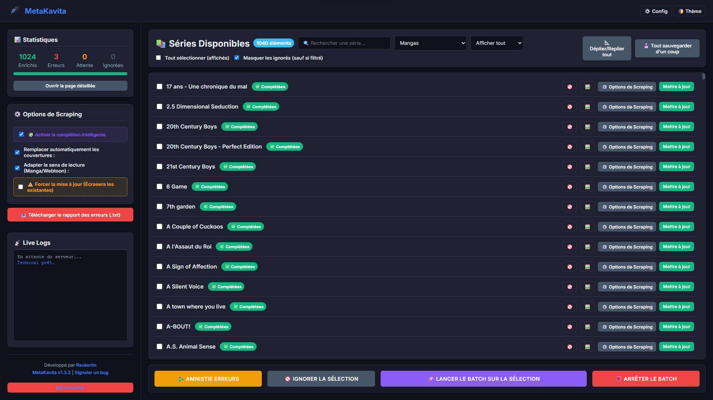
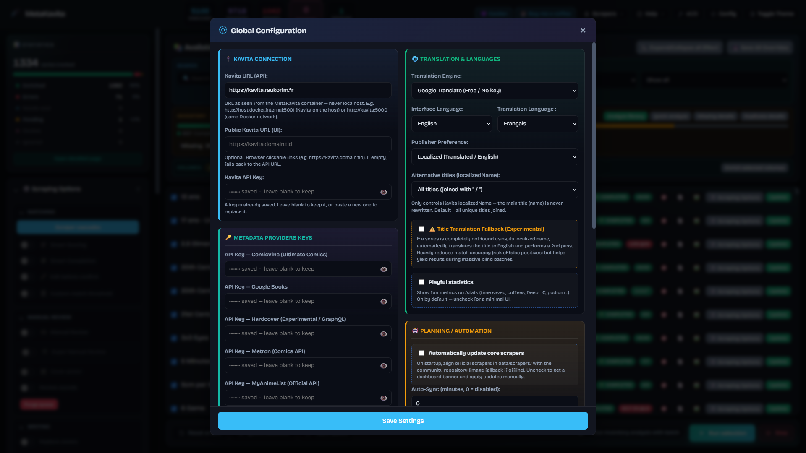
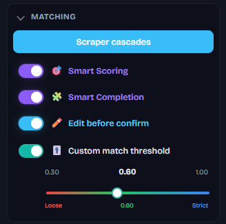
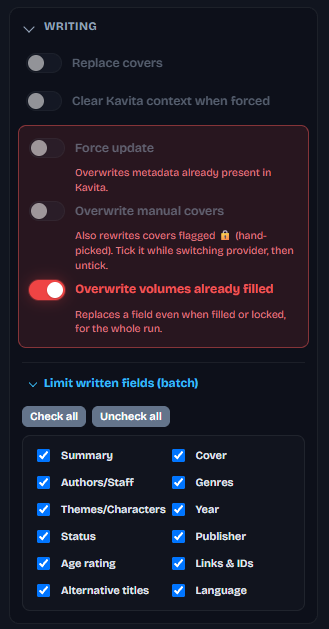
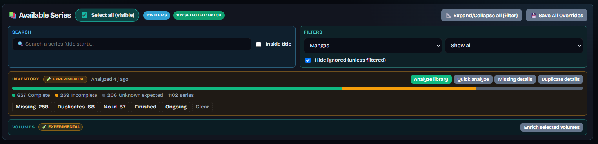
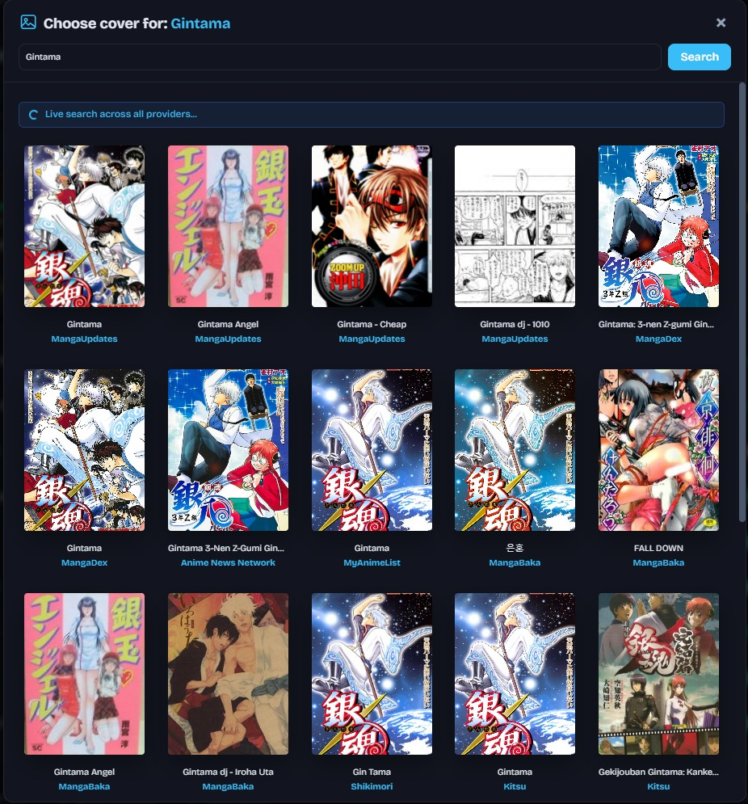
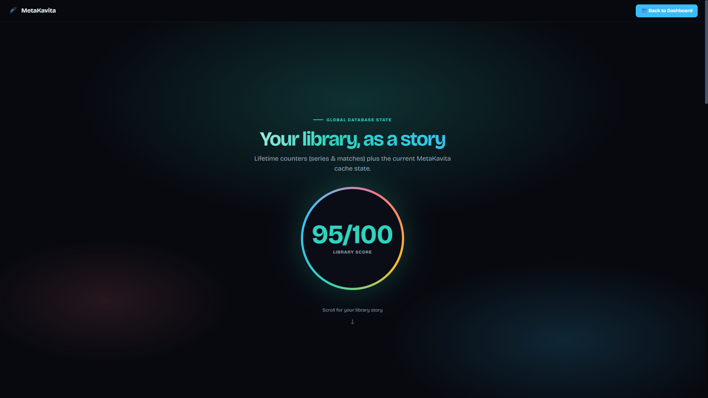

# Dashboard

[English](README.md) · [Français](../fr/dashboard.md)

← [Documentation](README.md)

The interface uses a 100% AJAX layout with zero page reloads. The left sidebar handles active strategic options, while the main panel presents your library. Local storage remembers your selected library, status filter, hide-ignored state, and search query. **Batch checkboxes** are remembered per library (`mk_batch_selection:*`) so you can resume after a refresh or network drop.

## Dual-form architecture (modal + sidebar)

Technical infrastructure fields live in the **Global Configuration** modal (⚙️ Config in the topbar). Provider API keys sit under the Kavita connection settings. Full field list: [Configuration](configuration.md).

The left sidebar **Scraping Options** card (click the title to collapse; open by default) is grouped by category. **Matching** opens [Provider cascades](scrapers.md#provider-cascades) and toggles Smart Scoring, Smart Completion, edit-before-confirm, and the optional reliability barometer (`0.30`–`1.00`, default `0.60`).

The same card also holds [Manual Review](manual-review.md).

**Writing** controls what a batch may overwrite: replace covers, clear Kavita matching context when forced, force update, overwrite manual 🔒 covers, overwrite volumes already filled, and the **Limit written fields (batch)** mask (summary, cover, staff, genres, …).

## Toolbar

**Select all (visible)** and the item / batch counters sit above **Search** (title start, or **Inside title**) and **Filters** (library, status, hide ignored). **Expand/Collapse All** toggles every series options panel; **Save All Overrides** writes them together.

Below that: the [Inventory](inventory.md) strip (health bar, Missing / Duplicates / No id) and the [Volumes](volumes.md) **Enrich selected volumes** button.

## Magic Input, deep extraction, overrides

* **Deep Kavita extraction:** before querying the web, MetaKavita reads existing Kavita metadata (ISBN, authors) and uses it in the scoring matrix.
* **Smart Scoring (v1.6+):** configured providers compete — the best match wins (ties keep fallback order). Provider #1 runs first to seed ISBN/author context, then the others run in parallel. With Smart Completion, missing fields are filled from highest score to lowest.
* **Magic Input:** paste a provider URL or raw ID. MetaKavita detects the source, skips the search cascade, and scrapes that page.
* **Publisher preference:** per-series `Auto` | `VF/VA` | `VO`, overriding the global setting.
* **Targeted fields:** uncheck fields you do not want overwritten (summary, cover, authors, tags, publisher, …). Check all / Uncheck all on the series panel and on the sidebar batch mask.
* **Context reset on force update:** ignore existing Kavita matching context (authors / publisher / year / genres — ISBN stays available). If **WebLinks** is targeted, Kavita web links are **replaced** by this scrape’s set.

## Live covers and logs

The 🖼️ button on a series row opens **Choose cover**. The search box starts with the series title; you can type another query. Results stream over WebSockets as each provider answers. Click a thumbnail to send it to Kavita.

A cover you pick by hand is marked **🔒 Manual cover** and is not overwritten by a later automatic scrape. Click the chip to hand it back, or tick **Overwrite manual covers** (`COVER_FORCE_OVERWRITE`) for one run.

During a batch, the active series pulses and scrolls into view. A progress bar shows `done / total`. Successful series auto-uncheck. The topbar shows lifetime counters plus a session counter. The console streams sanitized logs over WebSockets.

## Needs seal (`NEEDS_RELOCK`)

If the Kavita metadata write succeeds but field re-locking fails, the series gets an orange **Needs seal** badge. MetaKavita retries automatically; you can also use the 🔒 action or filter.

## Playful statistics (`/stats`)

Optional (default on via `ENABLE_PLAYFUL_STATS`). The landing is **Your library, as a story**: lifetime counters plus the current cache, and a playful **Library score** (0–100). Scroll for the rest — Chart.js charts, hit-rate, fun cards, Manual Review achievements. Occasional **Buy Me a Coffee** tips may appear after a strong batch — never a paywall.

## Light mode

`UI_SHOW_MANUAL_REVIEW`, `UI_SHOW_INVENTORY`, `UI_SHOW_VOLUMES` in the configuration modal remove those families from the sidebar. **Hiding a section also switches that feature off** (Manual Review also empties the queue). Tick a section back and it returns switched off. A pass already running keeps its block on screen until it ends (the Cancel button lives there).

## Enriched metadata fields

MetaKavita adapts its strategy to Kavita library types (`Manga`, `Comic`, `ComicFlexible`, `Book`).

| Category | Metadata Fields | Mapped Source Details |
| :--- | :--- | :--- |
| **Core Details** | Localized Name / Alternative Titles | `LOCALIZED_TITLE_MODE` (default **all** = unique titles joined with `" / "`). Prefer/none + per-series lang override; never rewrites Series `name`. |
| | Summary / Description | Source language, or translated via Azure, DeepL, or Google |
| | Release Year | Publication start year |
| | Publication Status | Ongoing, On Hiatus, Completed, Cancelled |
| | Language | Target language (e.g. `fr`, `en`) |
| **Collections & Lore** | Genres | Capped by `MAX_GENRES` (default **5**) |
| | Tags | Capped by `MAX_TAGS` (default **15**) |
| | Characters | Character lists in Kavita |
| **Staff & Editing** | Writers | Original story authors & scriptwriters |
| | Pencillers | Illustrators & artists |
| | Colorists | Coloring staff |
| | Translators | Translation credits / localization groups |
| | Cover Artists | Original cover artists |
| | Editors, Letterers, Inkers | Extended staff roles |
| | Publisher | Licensed or original publisher (user preference) |
| **Classifications** | Age Rating | Safe, Suggestive, Erotica, Pornographic |
| **External IDs** | External Platform IDs | `AniListId`, `MalId`, `MangaBakaId` |
| | Web Links | Clickable official series URLs |

See also: [Manual Review](manual-review.md) · [Inventory](inventory.md) · [Volumes](volumes.md)
