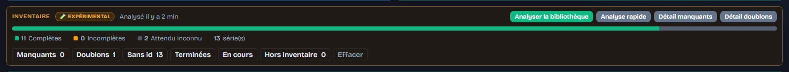

# Library Inventory

[English](README.md) · [Français](../fr/inventory.md)

← [Documentation](README.md)

On by default (`LIBRARY_INVENTORY_ENABLED`). Read-only: it never writes volume metadata and never merges series. Untick **Library inventory** in the sidebar to hide the panel; scraping and series metadata are untouched.

An **Inventory** panel above the series list tells you which series are incomplete. **Analyze library** / **Quick analyze** run in the background: they count the volumes (or chapters) you own in Kavita, ask the provider cascade how many there should be, and cluster look-alike series. **Missing details** and **Duplicate details** (or the **Duplicates** chip) open the lists.

You get:

* an interactive health bar (clicking segments or legend keys filters series on the dashboard)
* **Missing / Duplicates / No id / Excluded** interactive filter chips
* an `N/M` badge on each row, coloured by completion
* a per-series report with missing numbers folded into ranges
* CSV / TXT exports
* duplicate groups you can dismiss

**Missing details** (or the **Missing** chip) lists series whose owned count is below the catalogue expected (1…N). The modal includes:
* **Filter bar** (above the table):
  * **Quick search**: instantly filters missing series by title as you type.
  * **Status filters**: toggle between **All**, **Finished**, and **Ongoing** series to prioritize completed runs.
  * **Dynamic count badge**: shows the number of visible series matching your filters.
* **Sortable column headers**: click **Series**, **State**, **Publication**, or **Missing** to sort ascending or descending (`▲`/`▼`).
* **Volume Workshop direct link**: 1-click teal button on each row opens the series directly in the [Volume Workshop](volumes.md) to inspect and craft missing albums.
* **Reversible Quick Exclusion**: click **Exclude** to immediately remove a series from inventory counting (with confirmation), or **Re-include** to restore it, automatically updating dashboard badges, cards, and hygiene counters.
* **Include series with unknown expected (N/?)** adds the unknowns. **Volume report** opens the [per-series report](volumes.md). CSV / TXT at the bottom.

**Duplicate details** opens this modal. **Threshold** (Soft 0.85 / Medium 0.92 / Strict 0.97) instantly re-clusters duplicate groups in memory without needing a new scan or rescraping.
* **Batch toolbar** (above the list):
  * **Quick search**: instantly filters duplicates by series title as you type.
  * **🎯 Select all duplicates**: 1-click checks all secondary/less complete copies across all duplicate groups while strictly keeping the recommended most complete copy unticked.
  * **Deselect all**: unchecks all boxes in one click.
  * **Dynamic count badge**: displays live count of marked copies.
* Each group shows score, detection reasons, and real volume and chapter counts for each copy (`X tomes · Y ch.`), highlighted with a "🌟 Recommended (most complete)" badge when a genuine difference exists. Copies are compared in **equivalent volumes**: a copy Kavita only knows as chapters is measured at its true worth instead of being treated as empty. How many chapters make up a volume follows the **library type** convention: roughly ten for manga, six for comics (a trade paperback collects about six issues), twenty-five for a novel or light novel. A library whose type Kavita does not report, or a group mixing two of them, falls back to the manga convention. A run stored as 364 chapters therefore beats a lonely single volume, and both the confirmation alert and the 🎯 selection follow that same measure.
* Actions on copies: **Open Kavita**, **Not a duplicate**, **Ignore**, and **Mark as resolved** (dismisses handled groups without altering false-positive stats; dismissed groups are shared between individual libraries and the "All" view).
* **Archived duplicates view** (`📦` button in header): inspect all previously dismissed, ignored, or resolved duplicate pairs, and click **Restore** (`↩️`) to bring any pair back into the active duplicate review queue in 1 click.
* Tick **Trash** on extra copies: at least one series per group stays unticked, and an explicit confirmation alert warns you if you accidentally select "Trash" on a copy richer than the kept one.
* **Unknown path** means run Analyze again.

**Folder path prefix** (`INVENTORY_FOLDER_PATH_PREFIX`) is glued in front of each Kavita path in the script — e.g. `/mnt/media` + `/comics/…` → `/mnt/media/comics/…` or `C:/Media` on Windows. **Duplicate trash folder** (`INVENTORY_FOLDER_TRASH`) accepts both POSIX and Windows paths (`C:/...`, `D:\...`) and must sit outside Kavita libraries. Saving folder settings only updates paths without touching global server configuration.
* **Script format**: choose between POSIX Bash (`.sh`) and Windows PowerShell (`.ps1`). Scripts are hardened for safe interactive terminal copy-pasting (`set -u` in Bash, `$ErrorActionPreference = "Continue"` in PowerShell).
* **Live script preview**: an expandable code block (`📜 Live script preview`) displays ready-to-run script code in real time as you adjust selections.
* **Kavita scan at end**: check this box to automatically append Kavita API refresh commands (curl or `Invoke-RestMethod`) at the end of the script, combining file cleanup and Kavita library rescan in a single terminal run. **Your API key is never written into the script**: it reads the key from your terminal environment. Export it before running that block — `export KAVITA_API_KEY="your-key"` in Bash, `$env:KAVITA_API_KEY = "your-key"` in PowerShell — otherwise the script politely skips the rescan and tells you so. The key then never travels through your clipboard, the downloaded file, or your shell history.
* **Trashing never clobbers**: when two duplicates own folders that share a name, the script never replaces the one already waiting in your trash folder. It announces the skip (`SKIP  … already present in the trash folder`) and carries on — rename or empty the trash folder, then run it again. Bash and PowerShell behave identically.
* **Copy / Download**: copy directly to clipboard with a toast notification or download the script file.
* **⚡ Trigger Kavita Scan**: you can also trigger the scan manually in 1 click via this dedicated button.
* **Safe empty series purge**: if moving files left an empty series shell in Kavita (0 volumes), MetaKavita detects it and offers a 1-click purge (`/purge-empty`) directly in the volume report modal, safely verifying that no volumes or chapters remain before deleting the shell.

MetaKavita never runs that file-moving script itself: disk operations remain entirely under your control.

Expected counts can be forced by hand (**Forced expected** in the [volume report](volumes.md)), instantly reusing cached catalog data without redundant provider scrapes. A series no catalogue will ever know can be excluded from the counters (**Exclude from inventory**) while still being scraped.

Switch it off from the sidebar (**Inventory** category) and the panel, badges and API all go away. Hiding Inventory in [Light mode](dashboard.md#light-mode) also switches it off.

See [Volumes](volumes.md) for writing per-album metadata.
