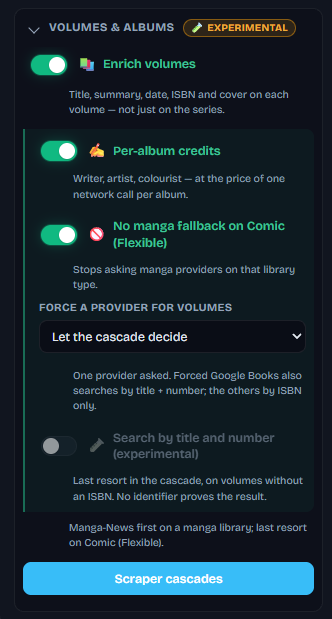
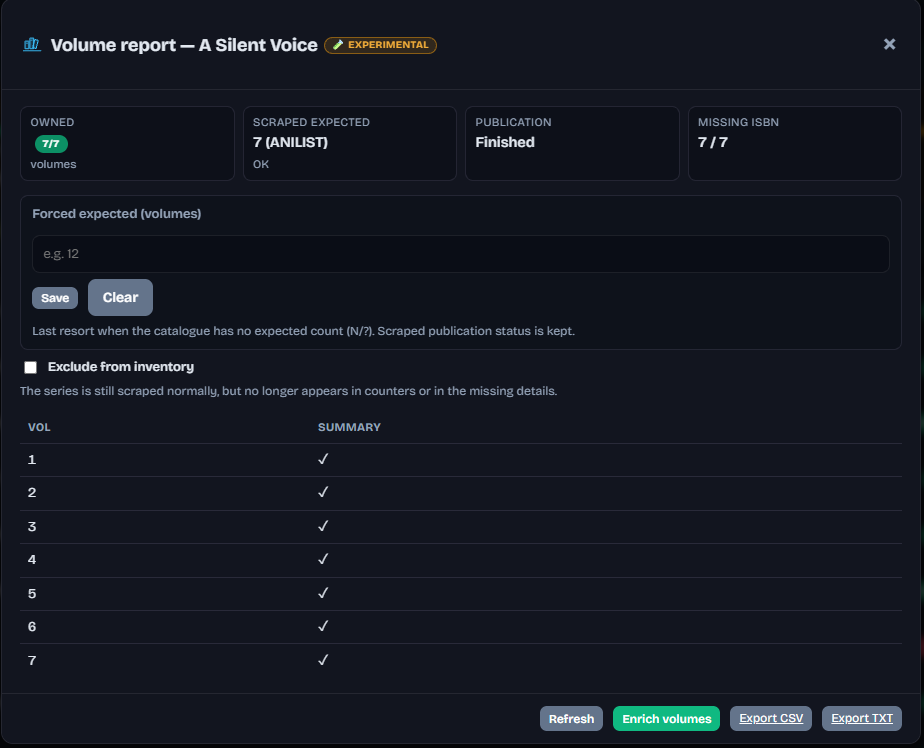

# Per-volume / album metadata

[English](README.md) · [Français](../fr/volumes.md)

← [Documentation](README.md)

Off by default (`VOLUME_ENRICHMENT_ENABLED`). While it is off, the buttons are hidden and the API answers 403. Enable it from the sidebar **Volumes & albums** block (marked experimental).

Where the [Inventory](inventory.md) tells you what is missing, this fills in what is there. The toolbar **VOLUMES** block (same strip as Inventory) has **Enrich selected volumes** — it uses the same series ticks as the scraping batch.

The per-series **Volume report** (📑 on the series row) is shared with Inventory: owned vs scraped expected, publication status, missing ISBN, a table of volumes (summary ✓ when filled), **Forced expected**, and **Exclude from inventory**. Footer: **Refresh**, **Enrich volumes**, CSV / TXT.

**Enrich volumes** then previews what would be written, volume by volume, with a tick box on every row — nothing is sent until you apply.

Written in this first version: **album title, summary, release date, ISBN and cover**, and only into fields that are empty. A field you filled by hand, or locked in Kavita, is left alone and says why in the preview.

A pass over the series you tick sits next to Analyze, with the same progress bar and Cancel — the same selection the scraping batch uses.

Sources: ComicVine (a hundred issues per request), Bédéthèque and Planète BD (album by album), Manga-News for French manga volumes, and, for volumes that already carry an ISBN, Google Books then Open Library then Hardcover. Author credits are a separate switch (`VOLUME_ENRICH_CREDITS`), off by default (one extra request per album).

`VOLUME_FORCE_OVERWRITE` lifts the fill-the-blanks rule for a run, for instance after switching provider.

## One-shots

A one-shot is a single file; Kavita gives it no volume number. When it carries an **ISBN**, MetaKavita goes straight to the ISBN providers. When it has neither volume number nor ISBN, the series is set aside without a request, and the preview says so. Owning only volume 1 of a numbered series is still enriched.

## Manga

Manga-News lists French volumes (album title, summary, ISBN, release date), one page per volume — first on a manga library, last resort on Comic (Flexible). MangaDex still fills the real cover of every volume (one request for the series) and does not cancel the rest of the cascade. Volumes that already carry an ISBN are looked up on Google Books, then Open Library, then Hardcover.

`VOLUME_ENRICH_EXPERIMENTAL` searches Google Books by series title plus volume number when there is no ISBN and no Manga-News hit. Each candidate's title must contain the series name *and* announce the volume number before anything is written. Read the preview before applying.

Hiding volume enrichment in [Light mode](dashboard.md#light-mode) also switches the pass off.

See [Configuration](configuration.md) for `VOLUME_PROVIDER`, `VOLUME_NO_MANGA_FALLBACK`, and related keys.
