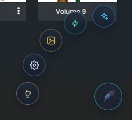
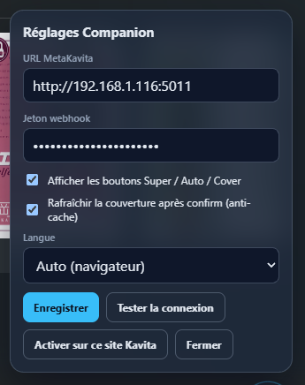

# MetaKavita Companion

[English](../en/companion.md) · [Français](README.md)

← [Documentation](README.md)

Chrome + Firefox MV3 (extension **1.0.28**, MetaKavita **1.7.0**+). **Bêta / early access** — sideload uniquement ; **pas** sur le Chrome Web Store ni Firefox AMO.

Menu flottant sur les **fiches série** Kavita (pas le reader). La plume ouvre l'arc : **Super Review**, **Auto**, **Cover**, **Config**, **Buy me a coffee**.

Super Review via `/companion/embed` si les schémas d'URL matchent. Un Kavita en HTTPS avec un MetaKavita en HTTP ne peut pas l'embarquer (contenu mixte) : la review s'ouvre dans une petite **fenêtre dédiée** centrée sur Kavita et se ferme à la fin. Les aperçus de couverture qui transitent par MetaKavita sont récupérés par l'extension.

Les one-shots Companion **passent outre** les toggles Review / Super, passent devant la file batch (après le job en cours) et **remplacent** tout job pending pour la même série.

## Install (sideload)

**Chrome / Edge :** télécharger [`metakavita-companion-chrome.zip`](https://github.com/raukorim-bot/MetaKavita/raw/dev/companion/dist/metakavita-companion-chrome.zip) → extraire → `chrome://extensions` → Mode développeur → Charger non empaquetée.

**Firefox :** télécharger [`metakavita-companion-firefox.zip`](https://github.com/raukorim-bot/MetaKavita/raw/dev/companion/dist/metakavita-companion-firefox.zip) → extraire → `about:debugging` → Charger un module temporaire → `manifest.json`.

**Config** (ou la popup de l'extension) ouvre **Réglages Companion** : URL MetaKavita, jeton webhook (dans MetaKavita → [Configuration](configuration.md) / Auto-Sync), **Afficher les boutons Super / Auto / Cover**, **Rafraîchir la couverture après confirm (anti-cache)**, langue (**Auto (navigateur)** / FR / EN). Puis **Enregistrer**, **Tester la connexion**, **Activer sur ce site Kavita**.

Guide : [`companion/README.md`](../../companion/README.md) (aussi menu Aide). Pack : `node companion/scripts/pack.mjs`.

Les deux archives sont aussi proposées par l'**encart sous la barre du haut**. Sa croix le masque pour ce navigateur ; **Aide → Télécharger le Companion** le fait revenir.

Les flags webhook de l'extension sont dans [Automation](automation.md).
