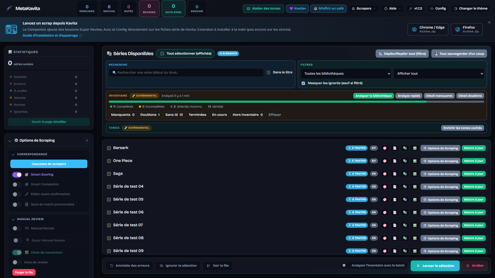

# Tableau de bord

[English](../en/dashboard.md) · [Français](README.md)

← [Documentation](README.md)

L'interface est 100 % AJAX. La barre latérale gauche gère la stratégie ; le panneau central affiche tes œuvres. Le stockage local retient bibliothèque, filtre de statut, masquage des ignorés et recherche. Les **cases du batch** sont mémorisées par bibliothèque (`mk_batch_selection:*`).

## Architecture double-formulaire (modal + sidebar)

Les champs d'infrastructure sont dans la **Configuration globale** (⚙️ Config). Les clés d'API sont regroupées sous la connexion Kavita. Liste complète : [Configuration](configuration.md).

La carte **Options de scraping** (pliable, ouverte par défaut) est groupée par catégorie. **Matching** ouvre les [cascades de providers](scrapers.md#cascades-de-providers) et les interrupteurs Smart Scoring, Complétion intelligente, édition avant confirm, et le baromètre de fiabilité optionnel (`0.30`–`1.00`, défaut `0.60`).

Le **mapping par champ** (expérimental, masqué en mode léger, éteint par défaut) laisse l'Auto choisir un fournisseur par champ : une source par défaut (la cascade, ou un fournisseur) plus des overrides, y compris un onglet Comic (Flexible) à deux vagues. Sans Force update, un champ déjà rempli dans Kavita n'est pas écrasé. Un fournisseur forcé sur une série ignore la carte. La Review manuelle ne change pas. Le mapping ne réutilise un scraper déjà répondu dans la cascade que si l'appel a utilisé la même query et le même flag id que l'override (un ID magique n'est pas gardé comme couverture d'un autre fournisseur), et n'appelle en parallèle que ceux qui manquent encore (une série à la fois).

La même carte contient aussi la [Review manuelle](manual-review.md).

**Writing** règle ce qu'un batch peut écraser : remplacer les couvertures, purger le contexte Kavita si forcé, mise à jour forcée, écraser les couvertures 🔒 manuelles, écraser les tomes déjà remplis, et le masque **Limiter les champs écrits (batch)** (résumé, couverture, staff, genres, …).

## Barre d'outils

**Tout sélectionner (visible)** et les compteurs d'items / batch au-dessus de **Recherche** (début de titre, ou **Dans le titre**) et **Filtres** (bibliothèque, statut, masquer les ignorés). **Déplier/Replier tout** ouvre tous les panneaux d'options ; **Enregistrer tous les forçages** les écrit ensemble.

En dessous : la bande [Inventaire](inventory.md) (barre de santé, Manquants / Doublons / Sans id) et le bouton [Tomes](volumes.md) **Enrichir les tomes sélectionnés**.

## Champ magique, extraction profonde, forçages

* **Extraction profonde Kavita :** avant le web, lecture des métadonnées Kavita (ISBN, auteurs) pour la matrice de score.
* **Smart Scoring (v1.6+) :** les fournisseurs configurés sont comparés — le meilleur match gagne (égalité → ordre de fallback). Le provider #1 tourne d'abord pour amorcer ISBN/auteurs, puis les autres en parallèle. Avec la Complétion intelligente, les champs manquants sont comblés du score le plus haut au plus bas.
* **Champ magique :** colle une URL ou un ID. MetaKavita détecte la source, contourne la cascade, et scrape cette page.
* **Préférence d'éditeur :** par série `Auto` | `VF/VA` | `VO`.
* **Champs ciblés :** décoche ce que tu ne veux pas écraser. Tout cocher / Tout décocher sur la série et sur le masque batch.
* **Purge du contexte (force update) :** ignore le contexte de matching Kavita (auteurs / éditeur / année / genres — l'ISBN reste disponible). Si **WebLinks** est ciblé, les liens Kavita sont **remplacés** par ceux du scrape.

## Couvertures et journaux en direct

Le bouton 🖼️ d'une série ouvre **Choix de la couverture**. Le champ part du titre ; tu peux taper une autre requête. Les résultats arrivent en flux via WebSockets, fournisseur par fournisseur. Clique une miniature pour l'envoyer à Kavita.

Une couverture choisie à la main est marquée **🔒 Couverture manuelle** et n'est plus écrasée. Clique la cartouche pour la rendre, ou coche **Écraser les couvertures manuelles** (`COVER_FORCE_OVERWRITE`) le temps d'un run.

Pendant un lot, la série active pulse et défile. Une barre affiche `fait / total`. Une série OK se décoche. La topbar montre les compteurs lifetime et session.

Une série qui a ses propres Options — fournisseur forcé, ID magique, masque de champs qui n'est plus « tout » (une case décochée suffit), titre alternatif différent du nom Kavita, préférence d'éditeur autre qu'Auto (VF/VA ou VO), ou tags de langue du titre localisé — porte une cartouche sur la ligne. Cliquez pour ouvrir les Options. Le panneau préremplit le nom Kavita, donc pas de cartouche titre si la valeur enregistrée est le nom de la série. Un fournisseur forcé ignore le mapping Auto par champ.

Le **Journal** de la barre latérale reprend la police du reste de l'app. L'heure est à gauche ; la série (`« One Piece » (5605)`) est nommée une fois, puis les lignes suivantes restent avec elle ; erreurs et alertes ont un liséré. **Pause** (ou un défilement vers le haut) arrête le saut pour relire ; **Vider** vide le volet. Les lignes épurées arrivent toujours par WebSockets.

## À sceller (`NEEDS_RELOCK`)

Si l'écriture Kavita réussit mais que le re-verrouillage échoue, badge orange **À sceller**. MetaKavita retente automatiquement ; action 🔒 ou filtre aussi.

## Statistiques ludiques (`/stats`)

Optionnel (défaut on via `ENABLE_PLAYFUL_STATS`). L'accueil est **Ta bibliothèque, en récit** : compteurs lifetime + état du cache, et un **Score bibliothèque** ludique (0–100). Fais défiler pour la suite — graphiques Chart.js, taux de hit, cartes fun, hauts-faits Review manuelle. Des tips **Buy Me a Coffee** peuvent apparaître après un bon batch — jamais de paywall.

## Mode léger

`UI_SHOW_MANUAL_REVIEW`, `UI_SHOW_INVENTORY`, `UI_SHOW_VOLUMES`, `UI_SHOW_FIELD_MAPPING` retirent ces familles de la sidebar. **Masquer une section éteint aussi la fonctionnalité** (la Review vide aussi la file). Recochez : elle revient éteinte. Le mapping par champ est masqué par défaut. Une passe en cours garde son cartouche jusqu'à la fin (bouton **Annuler**).

## Métadonnées enrichies

MetaKavita s'adapte aux types de bibliothèque Kavita (`Manga`, `Comic`, `ComicFlexible`, `Book`).

| Catégorie | Métadonnée Kavita | Détails |
| :--- | :--- | :--- |
| **Identité** | Titre localisé / alternatif | `LOCALIZED_TITLE_MODE` (défaut **all** = titres uniques joints par `" / "`). Prefer/none + override par série ; ne réécrit jamais Series `name`. |
| | Résumé | Conservé ou traduit via Azure, DeepL ou Google |
| | Année de sortie | Année de début de publication |
| | Statut | En cours, En pause, Terminé, Abandonné |
| | Langue | Langue cible (ex. `fr`, `en`) |
| **Thématiques** | Genres | Plafond `MAX_GENRES` (défaut **5**) |
| | Tags | Plafond `MAX_TAGS` (défaut **15**) |
| | Personnages | Liste enrichie |
| **Staff & édition** | Scénaristes | Auteur d'origine / scénaristes |
| | Dessinateurs | Illustrateurs |
| | Coloristes | Équipe de colorisation |
| | Traducteurs | Crédits de traduction |
| | Dessinateurs de couverture | Couvertures originales |
| | Éditeurs, encreurs, lettreurs | Selon les sources |
| | Éditeur | Licencié VF/VA ou origine (choix utilisateur) |
| **Classifications** | Âge | Sûr, Suggestif, Érotique, Pornographique |
| **ID & liens** | Identifiants | `AniListId`, `MalId`, `MangaBakaId` |
| | Liens web | URL cliquables dans Kavita |

Voir aussi : [Review manuelle](manual-review.md) · [Inventaire](inventory.md) · [Tomes](volumes.md)
