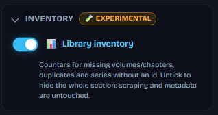
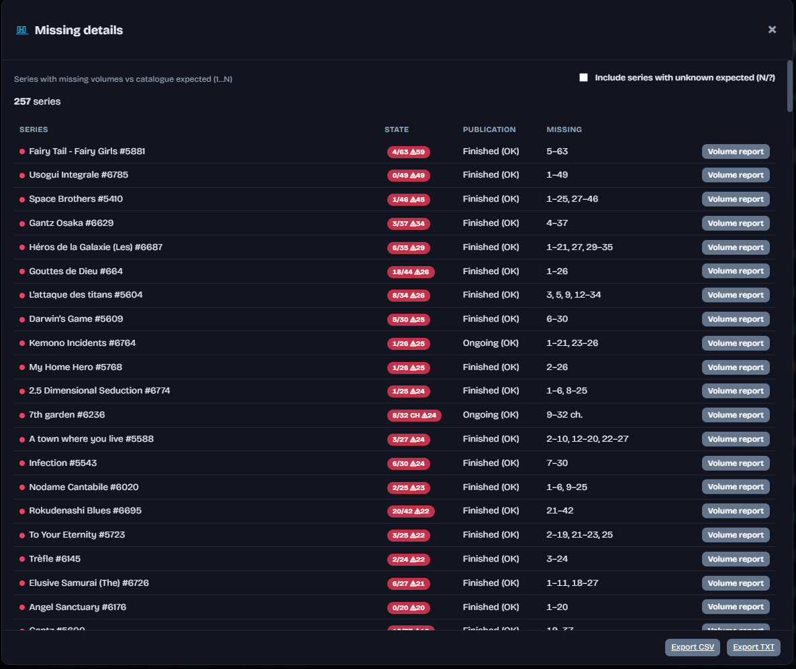
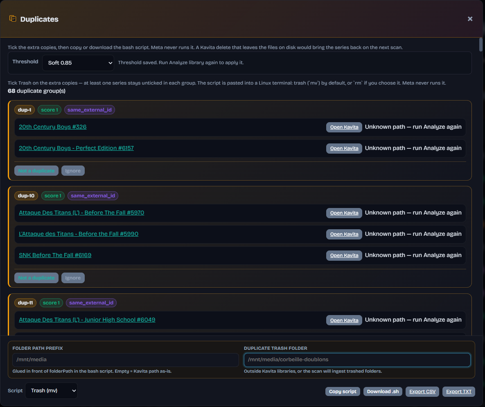

# Inventaire

[English](../en/inventory.md) · [Français](README.md)

← [Documentation](README.md)

Allumé par défaut (`LIBRARY_INVENTORY_ENABLED`). Lecture seule : n'écrit aucune métadonnée de volume et ne fusionne jamais de séries. Décoche **Inventaire de la bibliothèque** dans la sidebar pour cacher le panneau ; le scraping et les métadonnées de série ne bougent pas.

Un panneau **Inventaire**, au-dessus de la liste, dit quelles séries sont incomplètes. **Analyser la bibliothèque** / **Analyse rapide** travaillent en arrière-plan : ils comptent les tomes (ou chapitres) dans Kavita, demandent à la cascade combien il devrait y en avoir, et regroupent les séries qui se ressemblent. **Détail des manquants** et **Détail des doublons** (ou le chip **Doublons**) ouvrent les listes.

Tu obtiens :

* une barre de santé
* des chips **Manquants / Doublons / Sans id**
* une cartouche `N/M` colorée sur chaque ligne
* un rapport par série (numéros manquants pliés en intervalles)
* des exports CSV / TXT
* des groupes de doublons à ignorer

**Détail des manquants** (ou le chip **Manquants**) liste les séries sous l'attendu catalogue (1…N) : **Série**, **État** (`N/M`, Δ manquants), **Publication**, **Manquants** (intervalles, ou `ch.` pour les chapitres). **Inclure les séries sans attendu (N/?)** ajoute les inconnues. **Rapport volumes** ouvre le [rapport par série](volumes.md). CSV / TXT en bas.

**Détail des doublons** ouvre cette modale. Le **Seuil** (Souple 0.85 / Médium 0.92 / Strict 0.97) demande une nouvelle Analyse. Chaque groupe montre score et raison (`same_external_id`, titre proche, …) ; **Ouvrir Kavita**, **Pas un doublon**, **Ignorer**. Coche **Jeter** sur les copies en trop (une série au moins reste décochée par groupe). **Chemin inconnu** : relance Analyser.

Le **Préfixe des chemins** (`INVENTORY_FOLDER_PATH_PREFIX`) est collé devant chaque chemin Kavita dans le script — ex. `/mnt/media` + `/comics/…` → `/mnt/media/comics/…`. La **Corbeille des doublons** (`INVENTORY_FOLDER_TRASH`) doit rester hors des bibliothèques Kavita. Puis **Copier le script** ou **Télécharger le .sh** (`Corbeille (mv)` ou `Supprimer (rm -rf)`), plus CSV / TXT.

MetaKavita n'exécute jamais ce script et ne supprime plus de fiche Kavita : un delete qui laisse les fichiers sur le disque revient au scan suivant.

L'attendu peut être forcé à la main (**Attendu forcé** dans le [rapport de tomes](volumes.md)). Une série qu'aucun catalogue ne connaîtra jamais peut être exclue des compteurs (**Exclure de l'inventaire**) tout en restant scrapée.

Désactive-le depuis la sidebar (catégorie **Inventaire**) : panneau, cartouches et API disparaissent. Masquer l'Inventaire dans le [mode léger](dashboard.md#mode-léger) l'éteint aussi.

Voir [Tomes](volumes.md) pour écrire les métadonnées d'album.
