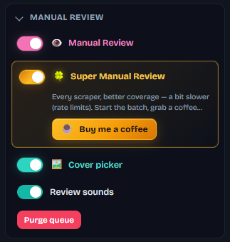
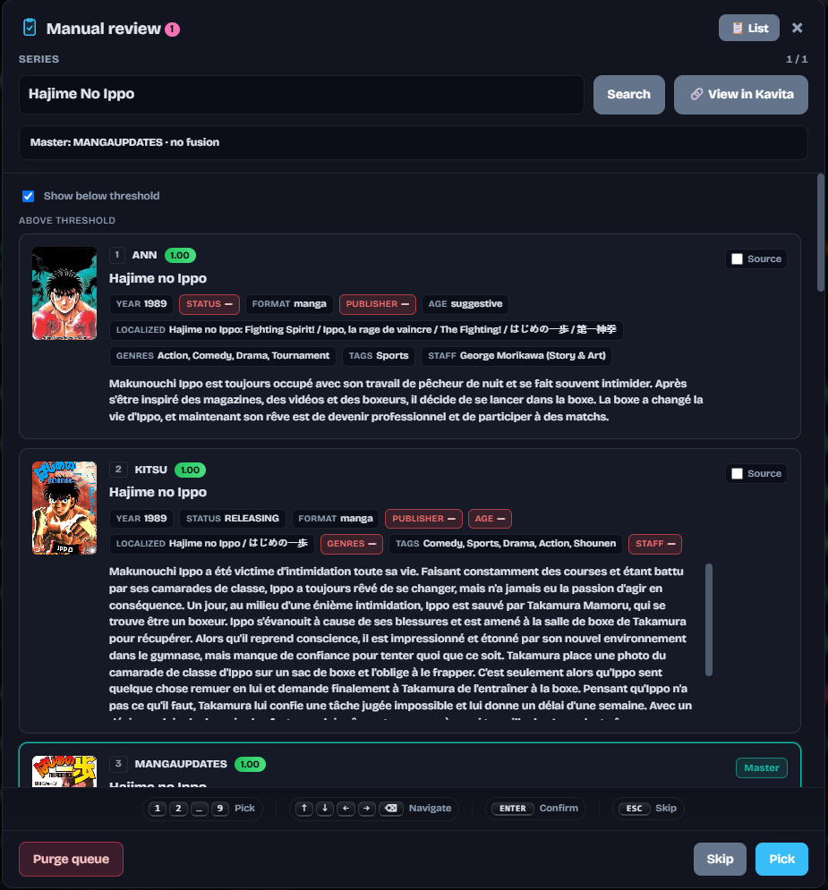
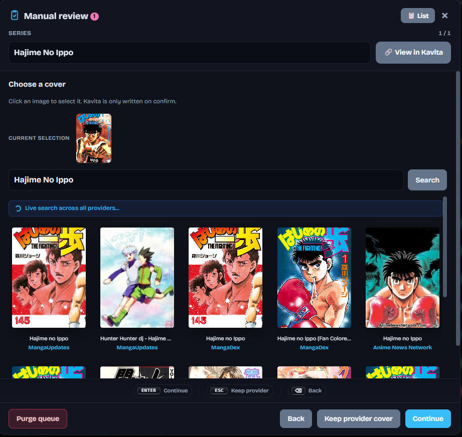
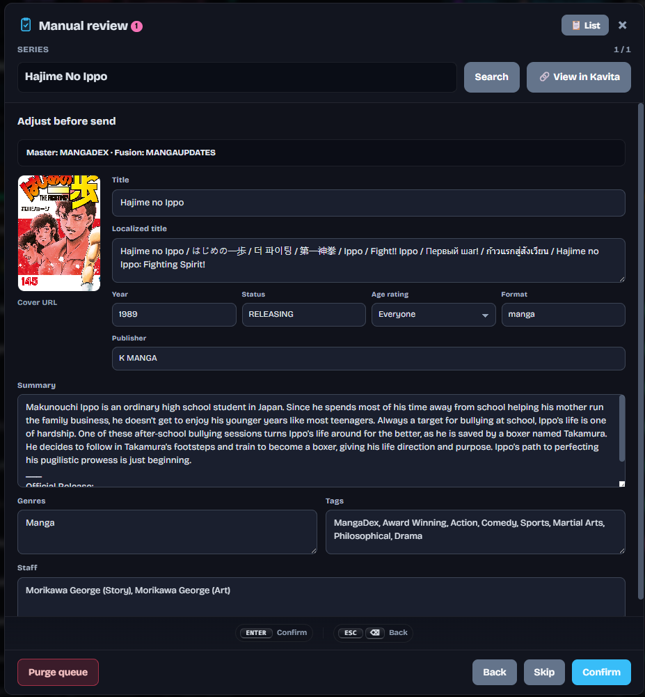

# Review manuelle

[English](../en/manual-review.md) · [Français](README.md)

← [Documentation](README.md)

Bloc sidebar **Review manuelle** : le batch scrape les providers comme d'habitude mais **n'écrit pas dans Kavita**. Chaque série est garée en `PENDING_REVIEW` avec des candidats scorés (au-dessus / sous le seuil de fiabilité).

**Super Manual Review** interroge tous les scrapers utilisables (pas seulement les trois slots) — meilleure couverture, un peu plus lent à cause des rate limits. **Cover picker** permet de choisir une couverture avant confirm. **Review sounds** joue des sons UI. **Purge queue** vide les séries garées.

Ouvre la modale depuis le badge topbar. **Rechercher** relance sous un autre titre ; **Voir dans Kavita** ouvre la série. Les cartes sont **Au-dessus du seuil** (ou **Afficher sous le seuil**) ; coche **Source** pour combler les trous du **Master** teal. **Complétion manuelle** (dans la modale) affiche une case par champ : le master est tout coché ; cocher un champ ailleurs le lui prend — cover AniList et éditeur MangaBaka, par exemple. **Fusionner les champs** (uniquement si la complétion manuelle est cochée) autorise le multi-select sur les listes — tags, genres, staff ; les valeurs se concatènent, sans dédoublonnage en plus. Les scalaires restent à un gagnant. Les cases Source sont alors cachées ; le badge Master reste. Nettoyez le résultat dans **Ajuster avant envoi** avant l'écriture Kavita. **Liste** saute à une autre série garée. Pied : **Purger la file**, **Passer**, **Choisir** — touches `1`–`9`, flèches, `Entrée`, `Échap`.

Si le **Cover picker** est allumé, l'étape suivante est cette grille : **Sélection actuelle**, recherche live sur tous les providers, clic sur une miniature pour la changer. Kavita n'est écrit qu'à la confirmation. Pied : **Retour**, **Garder celle du provider**, **Continuer** (`Entrée` / `Échap` / `Retour arrière`).

Si **Éditer avant confirmation** est allumé (`MANUAL_REVIEW_EDIT`), **Ajuster avant envoi** est le dernier récap : URL de couverture, titre, titre localisé, année, statut, classification d'âge, format, éditeur, résumé, genres, tags, staff — avec la barre Master / Fusion. Chaque champ écrivable a une case : cochée = écriture, décochée = Kavita inchangé. Titre et format sont en lecture seule. Un override **champs ciblés** qui a retiré un champ verrouille cette case. Pied : **Retour**, **Passer**, **Confirmer** (`Entrée` / `Échap` / `Retour arrière`).

Récap de session et hauts-faits sur `/stats`.

Désactiver le mode vide la file pour ne pas laisser de séries gelées hors auto-sync.

Masquer la Review dans le [mode léger](dashboard.md#mode-léger) éteint aussi le mode et vide la file.

Réglages : `MANUAL_REVIEW_MODE`, `MANUAL_REVIEW_EDIT`, `MANUAL_REVIEW_SUPER`, `MANUAL_REVIEW_SOUNDS` — voir [Configuration](configuration.md).
