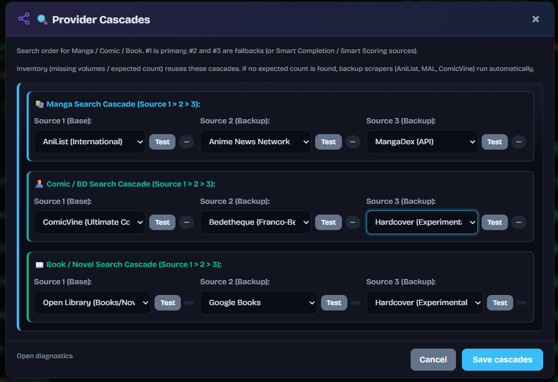
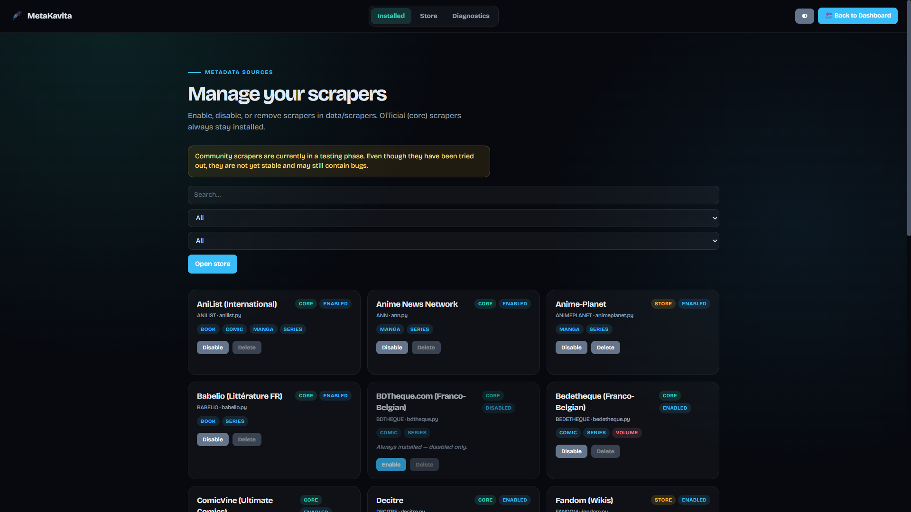
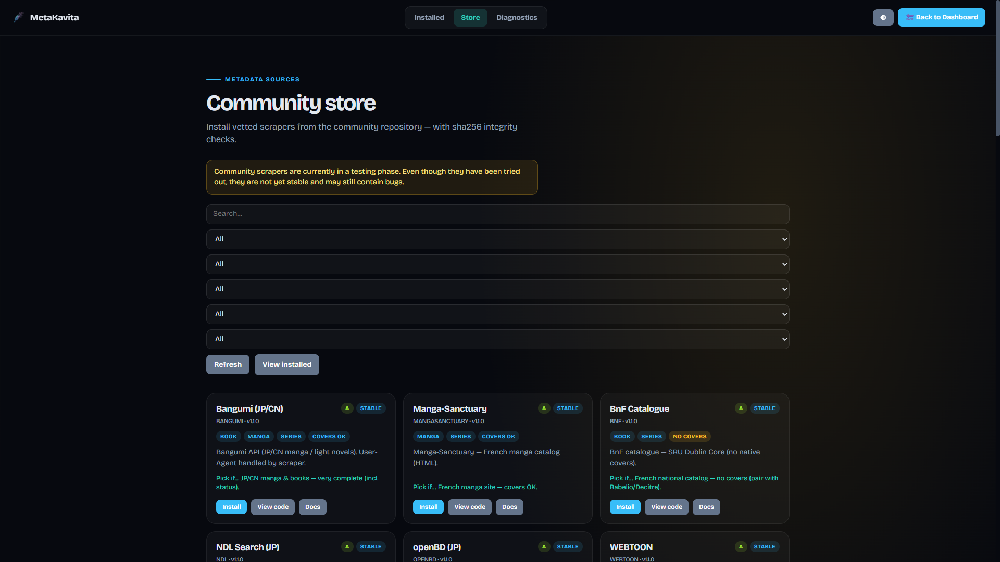
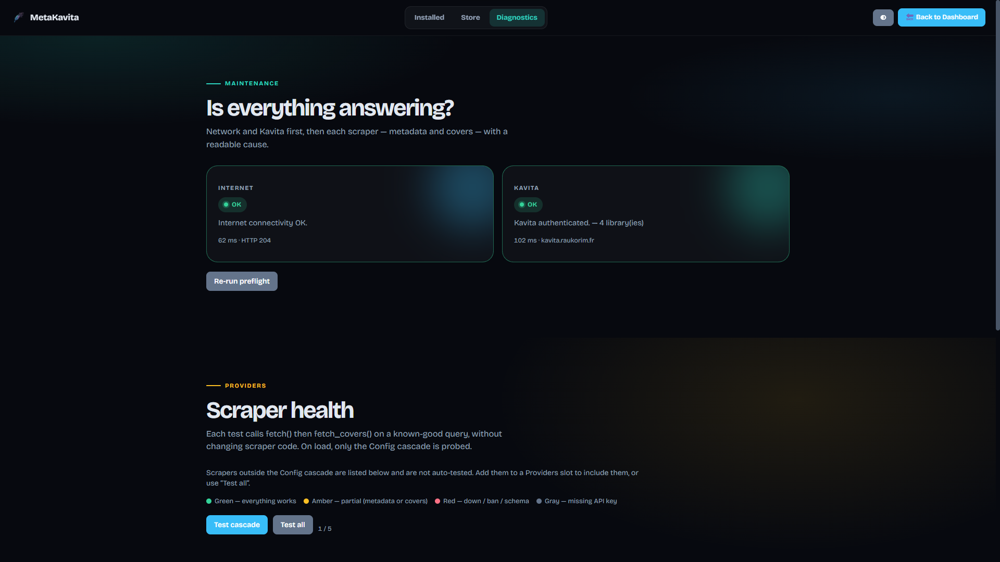

# Providers et scrapers

[English](../en/scrapers.md) · [Français](README.md)

← [Documentation](README.md)

## Cascades de providers

**Scrapers → Cascades de providers** (ou le bouton **Cascades** de la sidebar) fixe l'ordre de recherche par type de bibliothèque. Le #1 est le primaire ; #2 et #3 sont des fallbacks, et des sources pour Smart Scoring / Complétion intelligente. L'Inventaire (tomes manquants / attendu) réutilise ces cascades ; si aucun attendu n'est trouvé, des scrapers de secours (AniList, MAL, ComicVine) partent automatiquement.

Clés : `PROVIDER_1`–`3`, `COMIC_PROVIDER_1`–`3`, `BOOK_PROVIDER_1`–`3` — voir [Configuration](configuration.md).

## Sources incluses

Inclus d'office (v1.6.3) : Babelio, Decitre, SensCritique, ANN, LoCG, Planète BD et Metron (`METRON_API_KEY`) sont dans l'image avec AniList, ComicVine, Bédéthèque, etc. Préfère les slots Config plutôt que de sideloader des doublons de ces sept.

Regroupement habituel :

* **Manga :** MangaDex, AniList, Kitsu, Shikimori, MangaBaka, MangaUpdates, Manga-News, MyAnimeList, Anime News Network
* **Comics / BD :** ComicVine, Bédéthèque, BDTheque, Planète BD, Metron, League of Comic Geeks
* **Livres :** Google Books, Open Library, Hardcover, Babelio, Decitre, SensCritique

Certaines sources servent aussi un second type (AniList, MAL, MangaBaka, Google Books, Open Library, Hardcover, SensCritique).

**Comic Flexible (corrigé en v1.7.0) :** cascade hybride = providers Comic d'abord, puis Manga si aucun hit utile. S'applique au type Kavita **ID 1** (*Comic (Flexible)*), pas à l'ID 5 (*Comic*, cascade Comic stricte). Voir `CHANGELOG.md` 1.7.0.

**Wikidata** est Magasin uniquement (périmètre restreint — fallback / ISBN / IDs croisés, pas en primaire).

## Magasin

Aide → **Gérer les scrapers** (`/manage-scrapers`) et **Magasin** (`/scraper-store`). Onglets : **Installés**, **Magasin**, **Diagnostic**. La grille Installés distingue Core / Magasin, Activé / Désactivé, et les tags (Manga / Comic / Book / Série / Volume). Recherche et filtres, **Ouvrir le magasin**. Les cartes Core restent installées — **Désactiver** seulement (`DISABLED_SCRAPERS`) ; les Magasin se suppriment. Les scrapers community sont en phase de test.

L'onglet **Magasin** (`/scraper-store`) liste le catalogue community : installs contrôlées sha256, recherche et filtres (type / portée / statut / note / couvertures), **Actualiser**, **Voir les installés**. Chaque carte : **Installer**, **Voir le code**, **Docs**, plus tags (**Covers OK** / **Sans covers**). Même avertissement de phase de test.

Le registre charge `data/scrapers/`. Au boot, les modules core se rafraîchissent depuis le catalogue community (fallback image Docker si GitHub injoignable ; `AUTO_UPDATE_CORE_SCRAPERS` défaut on).

* Les community s'installent / se mettent à jour / se suppriment depuis le Magasin (catalogue GitHub + sha256) avec rechargement à chaud — pas de restart.
* Un dépôt manuel de fichier nécessite encore un restart.

1. Privilégie [community-scraper-metakavita](https://github.com/raukorim-bot/community-scraper-metakavita) via le Magasin.
2. Ou glisse un `.py` valide dans `data/scrapers/` puis restart.
3. Le scraper apparaît dans les listes, génère ses champs de clé si `needs_api_key`, et rejoint l'allowlist SSRF via `proxy_domains`.

Pour le **Smart Scoring**, déclare `uses_unified_scoring = True` et `attach_match_score(...)` (voir [`CUSTOM_SCRAPERS.md`](../../CUSTOM_SCRAPERS.md) §4). Sinon le scraper reste utilisable avec un score neutre.

Un `.py` dans `data/scrapers/` s'exécute avec les droits de l'application. Lis [Sécurité](security.md) et `CUSTOM_SCRAPERS.md` avant d'installer quoi que ce soit — y compris du code généré par IA.

## Diagnostic

L'onglet **Diagnostic** (`/diagnostics`, aussi Aide → **Diagnostic scrapers**). **Est-ce que tout répond ?** lance d'abord le préflight : **Internet** et **Kavita** (latence, statut HTTP, nombre de bibliothèques) — **Relancer le préflight** pour recommencer.

**Santé des scrapers** appelle ensuite `fetch()` puis `fetch_covers()` sur une query known-good, sans modifier le code. Au chargement, seule la cascade Config est sondée ; les autres restent listés tant que tu ne les mets pas dans un slot Providers ou que tu ne cliques pas **Tester tous**. **Tester la cascade** relance les slots. Légende : vert OK, orange partiel, rouge down / ban / schéma, gris clé API absente.

## Soyez gentils avec les providers

Ces API et sites sont souvent gratuits. Merci de :

1. Laisser MetaKavita cadencer. Pas plusieurs instances, pas de Sync en boucle, pas de gros batchs qui se chevauchent.
2. Compter ~**8 s/série** avec tout activé. Plus vite ? Un seul provider, et moins d'options.
3. Un passage planifié plutôt que des re-syncs de séries déjà terminées.
4. Premier remplissage ou force-batch massif : la nuit.
5. Ensuite, Auto-Sync / webhooks pour les nouvelles séries.

## Notes moteur

* Smart Scoring : le meilleur match gagne ; un score community mal formé ne plante pas l'enrichissement.
* Couvertures en Base64 pur (plus de Data URI fantôme).
* Rate limiter par provider ; après le #1, les autres tournent en parallèle.
* Mises à jour Kavita en cycle GET-fusion-POST pour ne pas nuller les champs non touchés.
* `MAX_TAGS` (15) et `MAX_GENRES` (5) via env / `config.json` — pas d'UI.
